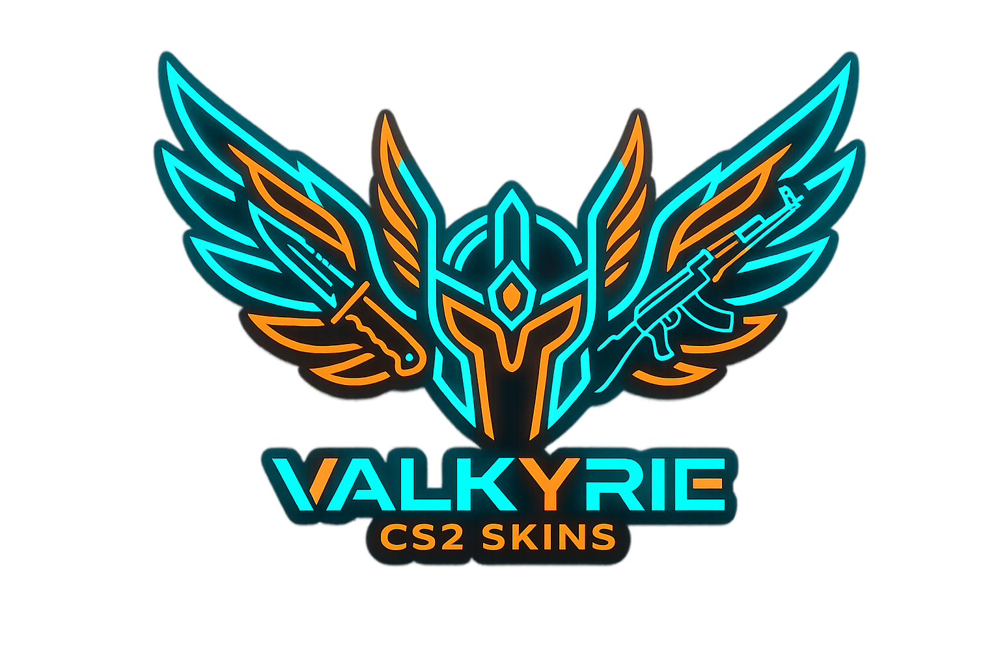

# Valkyrie Skin Shop 🗡️

Сучасний маркетплейс ігрових скінів з преміальним дизайном, інспектором предметів та системою апгрейдів.



## ✨ Особливості

- **🎭 Skin Shop:** Величезний вибір скінів з фільтрацією та сортуванням.
- **🔍 Skin Inspector:** Детальний перегляд кожного скіна перед покупкою.
- **🆙 Upgrader:** Система покращення ваших скінів з візуальними ефектами.
- **🛒 Cart System:** Зручний кошик для масових покупок.
- **🔐 Auth:** Повноцінна система авторизації та профілю користувача.
- **🎨 Custom UI:** Унікальний курсор, кастомні модальні вікна та плавні анімації.
- **📱 Responsive:** Повністю адаптований під мобільні пристрої.

## 🛠️ Технологічний стек

- **Frontend:** React + Vite
- **Styling:** Tailwind CSS + PostCSS
- **Backend:** Node.js (Express)
- **State Management:** React Context API
- **Animations:** CSS Keyframes & Transitions

## 🚀 Швидкий старт

### 1. Клонування репозиторію
```bash
git clone https://github.com/Fortennn/skinshop.git
cd skinshop
```

### 2. Встановлення залежностей
```bash
npm install
```

### 3. Запуск сервера розробки
```bash
# Запуск фронтенду
npm run dev

# Запуск бекенду (в іншому терміналі)
node server/server.js

# Запуск всього разом
npm run dev:all
```

## 📂 Структура проекту

- `src/components` — Перевикористовувані компоненти інтерфейсу.
- `src/pages` — Основні сторінки (Home, Shop, Upgrader, Profile).
- `src/context` — Логіка авторизації та валюти.
- `src/data` — Статичні дані про скіни.
- `server/` — Простий Express сервер для API.

## 📄 Ліцензія

Проект створено в навчальних цілях. Усі права на медіа-контент належать їх власникам.
